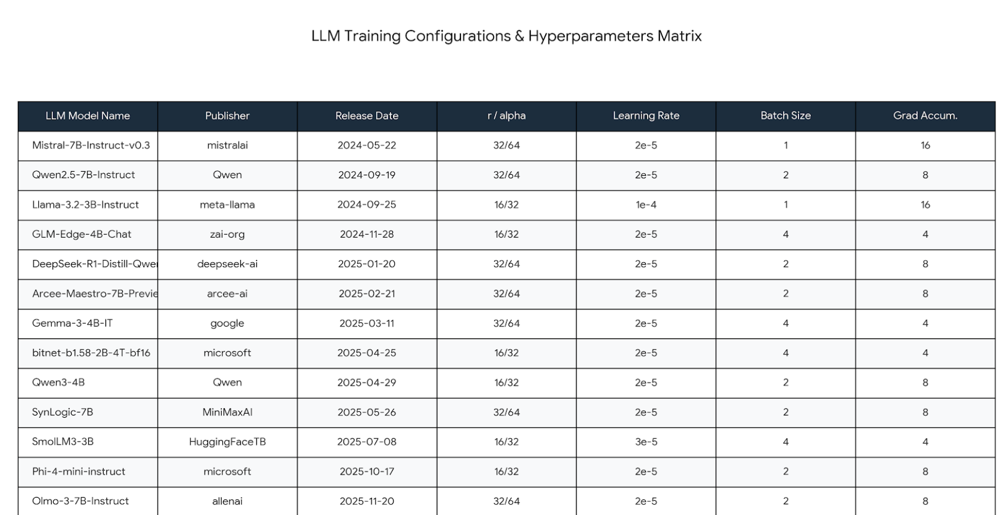

# Evaluation report

This report summarizes the saved EDA, training, and generation artifacts in this repository. It is based on the notebook outputs, every model's `metrics.json` file, and the 600 validation plus 800 test records stored in each `evaluation.json` file. No notebook was rerun to produce this report.

## Dataset and EDA

Qasper is organized around research papers, questions about those papers, and one or more annotated answers. The EDA notebook flattened the nested dataset into paper-, question-, and answer-level tables.

| Split | Papers | Questions | Answers |
| --- | ---: | ---: | ---: |
| Train | 888 | 2,593 | 2,675 |
| Validation | 281 | 1,005 | 1,764 |
| Test | 416 | 1,451 | 3,554 |
| **Total** | **1,585** | **5,049** | **7,993** |

The main observations were:

- Questions are short: the median is 8 words and the 95th percentile is 15 words.
- Answers are usually concise: the median is 6 words, while the 95th percentile is 42 words.
- Papers are much longer: the median context is 3,711 words, or about 5,120 reference-tokenizer tokens. The 95th percentile is about 9,688 tokens.
- More than 99.7% of full contexts exceed 1,024 reference-tokenizer tokens, so sending the complete paper to the model was not practical for these runs.
- The heuristic answer-type analysis found 3,539 abstractive, 2,421 extractive, 113 hybrid, 1,110 other, and 810 unanswerable answer records.
- The EDA marked about 70% of answer records as difficult because of long context, anomaly flags, or abstractive/hybrid answers.

The plots supporting these checks are stored in [`eda/reports/figures/`](eda/reports/figures/).

## Preprocessing used for fine-tuning

The model notebooks use the same main preparation steps, with small model-specific differences:

1. Normalize Unicode with NFKC, remove control characters, trim the text, and collapse repeated whitespace.
2. Resolve the answer type and convert unanswerable targets to `INSUFFICIENT_CONTEXT`.
3. Remove empty questions, empty non-unanswerable answers, unusually short or long questions, oversized answers, suspicious Unicode rows, and duplicate question-answer pairs.
4. Keep the original test split separate. The optional train/validation resplit is disabled in the saved configurations.
5. Cap the prepared datasets when needed. Most runs contain 2,246 training, 800 validation, and 1,200 test rows before generation sampling.
6. Split each paper into 384-token chunks with a 96-token overlap.
7. Rank chunks using question overlap and a small lead-position bonus. When evidence is available, evidence overlap contributes 40% of the chunk score, with an extra weight for sentence-level highlights.
8. Pack the highest-ranked chunks until the prompt context budget is reached.
9. Duplicate the rare `hybrid`, `unanswerable`, and `boolean` training rows once, then shuffle the training data.
10. Format each example with the model's chat template and supervise only the assistant answer tokens.

The training artifacts report 87.2% evidence coverage. Mean evidence recall after context packing ranges from 84.3% to 91.5% on training data and from 82.2% to 90.6% on validation data, depending on the model's prompt budget.

## Training time and hyperparameters

The configuration matrix below records the LoRA rank and alpha, learning rate, per-device batch size, and gradient accumulation used for each model.



The saved training summaries provide the corresponding epoch counts and runtimes:

| Model | Epochs | Training time | Learning rate | Batch | Grad. accum. | Effective batch | Max sequence |
| --- | ---: | ---: | ---: | ---: | ---: | ---: | ---: |
| `Mistral-7B-Instruct-v0.3` | 2 | 5h 40m | 2e-5 | 1 | 16 | 16 | 4,096 |
| `Qwen2.5-7B-Instruct` | 3 | 8h 57m | 2e-5 | 2 | 8 | 16 | 1,024 |
| `Llama-3.2-3B-Instruct` | 3 | 8h 26m | 1e-4 | 1 | 16 | 16 | 2,048 |
| `GLM-Edge-4B-Chat` | 3 | 5h 57m | 2e-5 | 4 | 4 | 16 | 1,024 |
| `DeepSeek-R1-Distill-Qwen-7B` | 3 | 7h 58m | 2e-5 | 2 | 8 | 16 | 1,024 |
| `Arcee-Maestro-7B-Preview` | 3 | 7h 46m | 2e-5 | 2 | 8 | 16 | 1,024 |
| `Gemma-3-4B-IT` | 2 | 3h 36m | 2e-5 | 4 | 4 | 16 | 768 |
| `BitNet-b1.58-2B-4T-bf16` | 3 | 4h 22m | 2e-5 | 4 | 4 | 16 | 1,024 |
| `Qwen3-4B` | 3 | 5h 19m | 2e-5 | 2 | 8 | 16 | 1,024 |
| `SynLogic-7B` | 2 | 5h 12m | 2e-5 | 2 | 8 | 16 | 1,024 |
| `SmolLM3-3B` | 3 | 4h 09m | 3e-5 | 4 | 4 | 16 | 1,024 |
| `Phi-4-mini-instruct` | 3 | 4h 27m | 2e-5 | 2 | 8 | 16 | 1,024 |
| `Olmo-3-7B-Instruct` | 3 | 7h 28m | 2e-5 | 2 | 8 | 16 | 1,024 |

All runs use an effective batch size of 16, the same dataset preparation, and the same evaluation sample caps. Eleven of the thirteen models also use a learning rate of 2e-5, while most are trained for three epochs with a 1,024-token sequence limit. These shared settings establish a consistent experimental protocol for an appropriate comparison. The limited model-specific adjustments shown in the table account for architecture, memory use, and runtime stability; the experiments should therefore be viewed as a consistent practical comparison rather than a perfectly controlled hyperparameter ablation.

## Why the main sequence length is 1,024

Ten of the thirteen runs use a maximum sequence length of 1,024. For those runs, approximately 824 tokens are reserved for packed paper context and about 200 tokens are left for the system message, question, answer prefix, and special tokens. Gemma uses 768, Llama 3.2 uses 2,048, and Mistral uses 4,096 because of model-specific memory and runtime choices. Mistral's saved prompt-context cap is still 1,024 tokens despite the larger maximum sequence length.

Within this project, 1,024 was the best operational default for the two-T4 setup when combined with evidence-aware context packing. The purpose was not to truncate the first 1,024 tokens of every paper. The notebook first selects the chunks that are most related to the question and annotated evidence, then places only those chunks in the prompt.

Feeding the full paper would add many tokens that are unrelated to the question. The more precise term for the resulting problem is **attention dilution**, sometimes discussed together with the **lost-in-the-middle** effect. Every additional token competes for attention probability, so irrelevant sections can weaken the signal from the useful evidence. Very long sequences also increase activation memory and attention computation, reducing the batch size and the number of experiments that fit in a Kaggle session.

This does not prove that 1,024 is universally optimal. It is the best practical setting used by most runs in this repository. A controlled sequence-length ablation with the same model and training seed would be required to make a causal claim. The poor 4,096-token Mistral run, for example, also has a generation-collapse issue and cannot be used as proof that longer context alone caused the failure.

## Evaluation protocol

Generation evaluation is capped at 600 validation and 800 test examples for every model. The report below uses the test split.

- **Validation perplexity** measures how well the fine-tuned model predicts the reference answer tokens. Lower is better. It is calculated from the saved validation loss.
- **BERTScore F1** is the main answer-similarity metric. It compares predictions and references in embedding space with `distilbert-base-uncased`, so it is less sensitive to exact wording than lexical metrics.
- **Grounding rate** checks whether the answer appears in, or has strong lexical overlap with, the packed context.
- **Abstention accuracy** measures whether unanswerable questions produce `INSUFFICIENT_CONTEXT`.
- **Critical error rate** is the fraction of confident predictions that are wrong.

Perplexity and semantic similarity are the two primary metrics in this report. Together, they indicate whether fine-tuning adapted a model to the answer distribution and whether its generated answer preserves the meaning of the reference. They are useful signals for this multi-hop scientific QA task, but they do not by themselves prove that a model followed the correct reasoning chain. Demonstrating that directly would require evidence-hop annotations or an evaluation of the intermediate reasoning path.

Exact match, BLEU, token F1, and ROUGE-L were also calculated and remain available in the JSON artifacts. They are treated as secondary diagnostics here because Qasper can contain several valid answer phrasings, while its reference answers are often short. A semantically correct paraphrase can therefore receive a weak lexical-overlap score. These metrics are not hidden selectively by model; they are omitted from the headline table because the same limitation affects the whole comparison.

The tables can be regenerated from the saved JSON files with:

```bash
python scripts/summarize_metrics.py
```

## Primary results

The rows are ordered by test BERTScore F1. Perplexity is measured on the validation split and lower is better; BERTScore is measured on the test split and higher is better.

| Model | Seq. | Validation perplexity | BERTScore F1 |
| --- | ---: | ---: | ---: |
| `microsoft/Phi-4-mini-instruct` | 1024 | 2.9195 | 79.86% |
| `Qwen/Qwen2.5-7B-Instruct` | 1024 | 2.4866 | 79.67% |
| `allenai/Olmo-3-7B-Instruct` | 1024 | 3.1485 | 79.29% |
| `Qwen/Qwen3-4B` | 1024 | 2.6816 | 79.24% |
| `HuggingFaceTB/SmolLM3-3B` | 1024 | 2.9033 | 78.80% |
| `meta-llama/Llama-3.2-3B-Instruct` | 2048 | 4.4300 | 78.67% |
| `MiniMaxAI/SynLogic-7B` | 1024 | 5.7265 | 75.24% |
| `deepseek-ai/DeepSeek-R1-Distill-Qwen-7B` | 1024 | 2.4340 | 75.00% |
| `arcee-ai/Arcee-Maestro-7B-Preview` | 1024 | 2.4414 | 74.75% |
| `zai-org/glm-edge-4b-chat` | 1024 | 2.5473 | 74.14% |
| `google/gemma-3-4b-it` | 768 | 11.9141 | 72.75% |
| `mistralai/Mistral-7B-Instruct-v0.3` | 4096 | 1.3307 | 66.74% |
| `microsoft/bitnet-b1.58-2B-4T-bf16` | 1024 | 3.6556 | 54.55% |

The strongest usable runs reach roughly 79% to 80% semantic similarity. Phi-4-mini has the highest BERTScore F1 at 79.86%, while Qwen2.5 combines a 79.67% BERTScore with a low validation perplexity of 2.4866. Qwen3, OLMo, and SmolLM3 are close behind. This is a good result for a difficult long-document task in which the model must select information from several parts of a scientific paper and return a concise answer.

Perplexity must still be read alongside generation behavior. Mistral has the lowest value, 1.3307, but returns `INSUFFICIENT_CONTEXT` for 772 of 800 test records. Its low teacher-forced loss did not translate into usable generation. This is why the semantic score and failure indicators remain necessary.

## Grounding, abstention, and failure indicators

| Model | Grounding | Abstention accuracy | Critical error | Insufficient outputs | Unique answers |
| --- | ---: | ---: | ---: | ---: | ---: |
| `Qwen/Qwen3-4B` | 69.25% | 82.28% | 49.12% | 38.88% | 376 |
| `Qwen/Qwen2.5-7B-Instruct` | 67.38% | 84.18% | 42.65% | 40.62% | 371 |
| `microsoft/Phi-4-mini-instruct` | 67.75% | 84.81% | 45.78% | 41.12% | 365 |
| `HuggingFaceTB/SmolLM3-3B` | 64.62% | 87.34% | 49.10% | 47.25% | 322 |
| `allenai/Olmo-3-7B-Instruct` | 61.25% | 86.71% | 53.50% | 49.25% | 323 |
| `meta-llama/Llama-3.2-3B-Instruct` | 89.00% | 0.00% | 86.79% | 0.00% | 578 |
| `MiniMaxAI/SynLogic-7B` | 53.00% | 83.54% | 79.10% | 42.50% | 385 |
| `google/gemma-3-4b-it` | 26.25% | 100.00% | 80.25% | 100.00% | 1 |
| `deepseek-ai/DeepSeek-R1-Distill-Qwen-7B` | 89.12% | 1.90% | 93.15% | 0.62% | 610 |
| `arcee-ai/Arcee-Maestro-7B-Preview` | 86.62% | 1.27% | 94.92% | 1.62% | 626 |
| `zai-org/glm-edge-4b-chat` | 56.25% | 21.52% | 87.33% | 9.50% | 618 |
| `mistralai/Mistral-7B-Instruct-v0.3` | 29.50% | 0.00% | 100.00% | 96.50% | 14 |
| `microsoft/bitnet-b1.58-2B-4T-bf16` | 100.00% | 0.00% | 100.00% | 0.00% | 1 |

## Reading the results

### Strongest balanced group

Qwen3-4B, Qwen2.5-7B-Instruct, Phi-4-mini, SmolLM3, and OLMo form the strongest group when semantic similarity, perplexity, and unanswerable-question handling are read together.

- Phi-4-mini has the highest BERTScore F1 at 79.86%.
- Qwen2.5 has the strongest balance between low validation perplexity and high semantic similarity. It also has the lowest critical-error rate in this group.
- Qwen3, OLMo, and SmolLM3 all remain close to 79% BERTScore F1.
- SmolLM3 and OLMo have the best abstention accuracy among the non-collapsed runs.

The critical-error rates remain high, even for the strongest models. Their confidence scores should therefore not be used as calibrated probabilities without a separate calibration stage.

### Llama 3.2

Llama 3.2 reaches 78.67% BERTScore F1 and has a high grounding rate, but its abstention accuracy is low. It often produces context-related text without following the expected short-answer or unanswerable-answer behavior.

### DeepSeek-R1-Distill-Qwen-7B

DeepSeek produces some good individual indicators: its validation perplexity is 2.4340, its BERTScore F1 is 75.00%, its grounding rate is 89.12%, and it generates 610 unique answers. Its 1.90% abstention accuracy and 93.15% critical-error rate nevertheless show that it does not follow the required answer behavior consistently.

This pattern suggests a task-format mismatch. The checkpoint was distilled for explicit reasoning behavior, while Qasper supervision mostly contains short final answers without reasoning traces. A better use of this model would be fine-tuning on reasoning-oriented datasets, or on a mixed dataset that contains scientific questions together with supervised rationales and a clearly separated short final answer. The current metrics support this interpretation, but they do not prove that the architecture itself is unsuitable for scientific QA.

### Collapsed or unreliable runs

Three runs should be debugged before they are compared as normal model results:

- BitNet generates the same 99-character exclamation-mark sequence for all 800 test records. Its reported 100% grounding rate is therefore not meaningful.
- Gemma returns `INSUFFICIENT_CONTEXT` for all 800 test records. Its 100% abstention accuracy only reflects that collapse and does not indicate general QA quality.
- Mistral returns `INSUFFICIENT_CONTEXT` for 772 of 800 records. Its metrics mainly measure this generation failure.

These cases point to tokenizer, padding, EOS handling, chat-template, or generation-configuration issues rather than a clean comparison of model capability.

## Limitations

- The runs use different sequence lengths, epoch counts, and some model-specific settings, so the table is a practical experiment comparison rather than a controlled architecture benchmark.
- Evaluation uses capped samples: 600 validation and 800 test records rather than every prepared row.
- The grounding metric is lexical and can reward copied or degenerate text; it is not a factuality judge.
- Perplexity measures reference-token prediction under teacher forcing, not the quality of free generation. BERTScore can also be generous to semantically related but incomplete answers. Neither metric verifies the intermediate evidence hops, so the behavior indicators and manual error analysis still matter.
- The saved EDA output reports empty `evidence_text` lengths, while the training artifacts report 87.2% evidence coverage and high packed-evidence recall. This mismatch should be resolved by regenerating the EDA and training CSV files from one shared evidence-extraction path.
- A controlled ablation is still needed for sequence length, context-ranking weight, LoRA rank, and confidence calibration.
